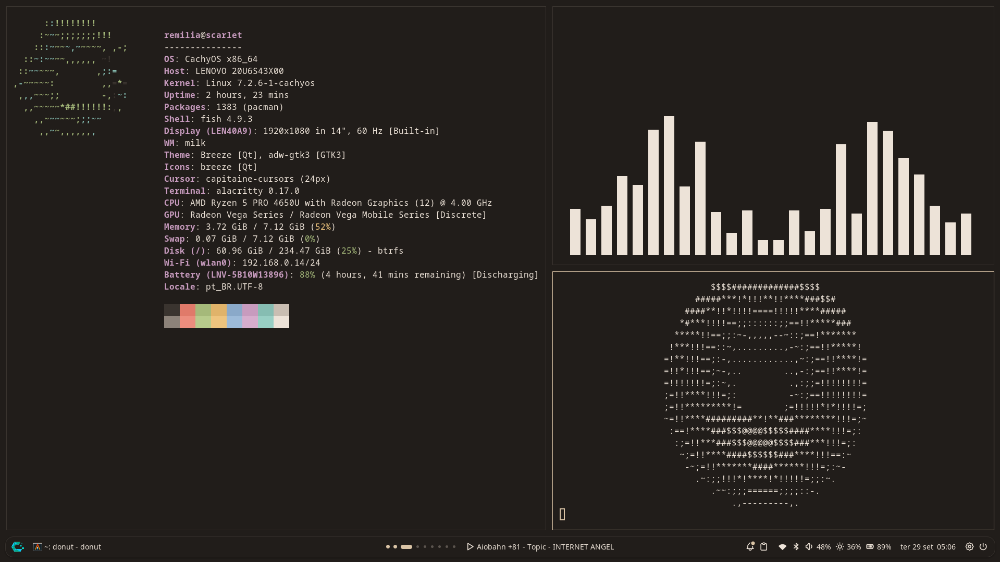

# milk



> A super lightweight, self-contained X11 desktop.

---

## Installation

On Arch Linux and its derivatives:

```sh
git clone https://github.com/mirvoxtm/milk.git
cd milk
./install.sh
```

The installer asks what you want, installs every dependency and also sets up
[Spoil](https://github.com/mirvoxtm/spoil), the file manager (Super+E), and
[lactase](https://github.com/mirvoxtm/lactase), the compositor (shadows, animations, transparency,
blur and smooth corners), next to milk.
`./install.sh --yes` takes the defaults without asking. Running it again reinstalls milk over the
existing installation (your settings stay).

Then log out and pick milk on the login screen. After every installation the setup walks you through
the language, theme, keyboard, wallpapers and bar (right away when you run the installer inside milk).
Change anything later with `milk settings`. It's as simple as that.
Your settings live in `~/.config/milk/milk.json`.

Updating from a version that kept `milk.json` inside the clone: if `git pull` refuses because of it,
run `git checkout -- milk.json && git pull`. milk then starts from fresh settings and shows the setup again.

## Reasoning & Philosophy

In my vision, the window manager, the bar and the desktop should live in one program and share one
configuration file. All within one self-containing application that handles everything for the simplicity of the user. The user should also have the ability to style each workspace according to their needs - and he should have instant feedback when customizing his own instance.

Milk is a long vision for the perfect Window Manager i've had since i started using dwm in 2019.
This endeavour was inspired mainly by EmbargoTM's "Temenos".

User simplicity is the absolute priority for milk - I mean, have you ever seen a TWM that lets you change and test your keyboard without having to do a bunch of stuff in a config file? Yeah.

### Credits
- [dwm](https://dwm.suckless.org), by the suckless.org community: milk's window manager is mainly based upon a port of dwm 6.5 to Odin, released under the MIT/X Consortium License.
- [Noctalia](https://github.com/noctalia-dev/noctalia-shell), whose bar inspired the layout and look of milk's bar.
- [MangoWC](https://github.com/DreamMaoMao/mangowc), an inspiration for the animation in the window manager.
- [picom](https://github.com/yshui/picom), the model for lactase, milk's compositor.
- [Temenos](https://github.com/EmbargoTM/Temenos), by EmbargoTM, for the original idea of giving each workspace its own identity.
- [Tabler Icons](https://tabler.io/icons) (MIT), the icon font used across the bar and panels.